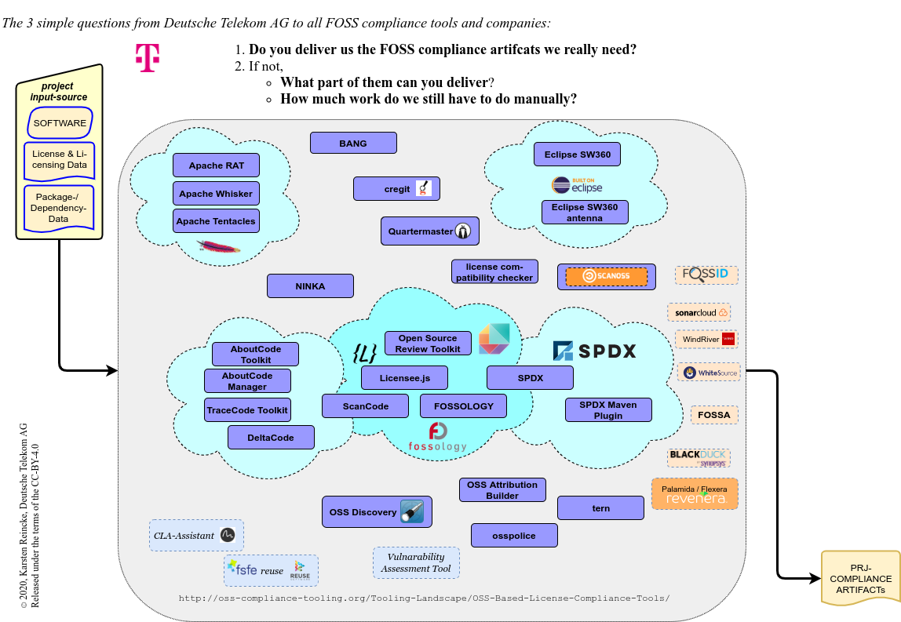
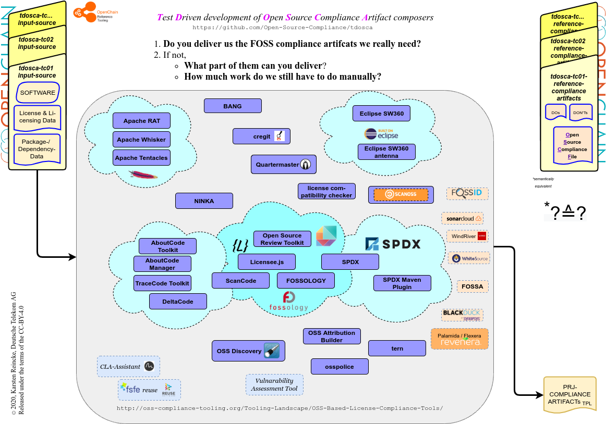
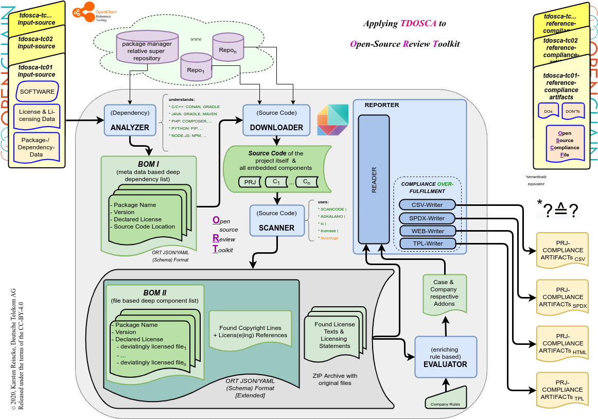
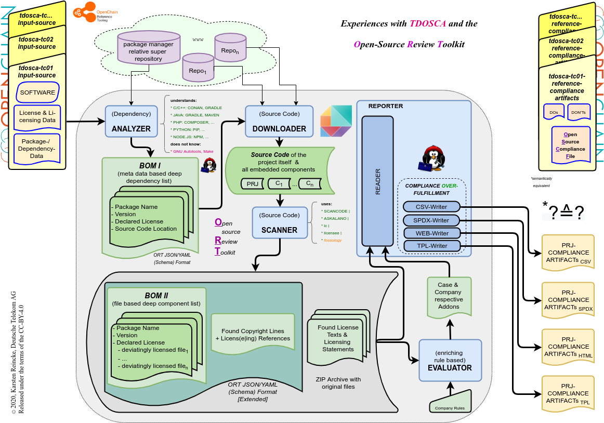
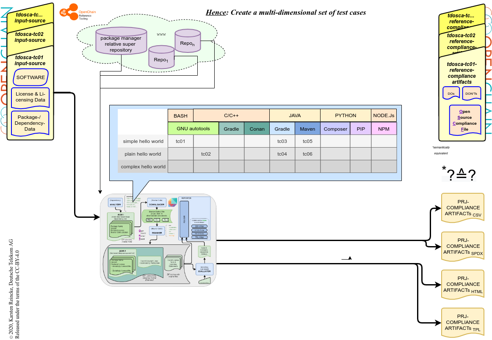
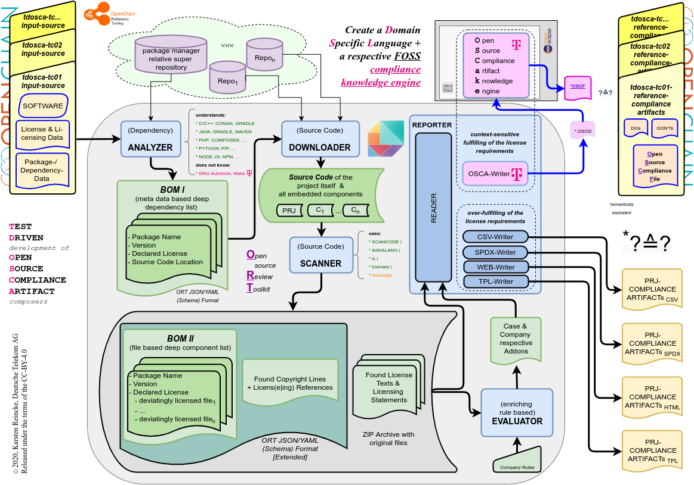

<!---
documentclass: extarticle
fontsize: 12pt
--->

# Test Driven development of FOSS Compliant Artifact Gatherers and Compilers

(c) 2020, Karsten Reincke, Deutsche Telekom AG

>This transcript of our lecture *'Test Driven Open Source Compliance Automation: A New Initiative Hosted at Open Chain'* hold on the [Open Compliance Summit 2020](https://events.linuxfoundation.org/open-compliance-summit/program/schedule/) is distributed under the terms of the CC-BY-4.0 license.

## Three Simple Questions

Without any doubt, there exist already many Open Source compliance tools. The Open-Chain-Reference-Tooling-Work-Group has compiled a list of relevant information:  [http://oss-compliance-tooling.org/Tooling-Landscape/OSS-Based-License-Compliance-Tools/](http://oss-compliance-tooling.org/Tooling-Landscape/OSS-Based-License-Compliance-Tools/). These information can be clustered according to various criteria:

- Some of the tools can be grouped by the offering organizations like
  - the Apache foundation,
  - SPDX
  - Eclipse
  - the About Code Initiative

- Some of the tools are on the sidelines because they have a specific focus or are not really tools or anything else.

- Some of the 'tools' can be grouped by the fact, that they are services, not tools.

*Deutsche Telekom* has a simple point of view on FOSS compliance tools. Whenever we in *DT* come across such a tool, we ask ourselves and its developers:

* Does this tool deliver us the FOSS compliance artifacts we really need?
* If not
  - What part of them can it deliver?
  - How much work do we still have to do manually, if we used it?

*DT* has a longer tradition of evaluating FOSS compliance tools. We met excellent tools and brilliant experts who often were completely convinced that they can essentially support us. But in the end, we mostly felt like that they didn't understand what we really needed (and still need). To clarify this point:

Whoever delivers us large lists of (found) FOSS items and says, that we now have to discuss each entry of the list with our legal department, does not help us: even if we didn't say it publicly, we would see him as a cost driver.

But Nevertheless, we have to deal with such large lists. *Deutsche Telekom* can't wait anymore. The complexity of our products enforces us to actively advance the automation of open source compliance. For solving that issue, we didn't want to start the next green field approach, but to participate in existing projects - entirely in the spirit of the open-source idea.

## Setting up the Test Driven Environment

Our first step was to improve our own communication. We thought we should clarify in a better way what we really need - from our point of view of large company dealing with many complex software stacks.

Thus, we tried to apply the idea of 'Test Driven Software Development' to the development of compliance tools:

We thought and we think that defining 'test cases' could be helpful

- On the one side these test cases should contain really usable software together with the licensing and dependency information as they are usually put together in real projects.

- On the other side these test cases should contain those compliance artifacts that - if added to the respective software package - would allow to distribute the software compliantly.

Additionally, we think,

- that *existing open source projects are mostly too complex for being used as reference material*
- that *artificially generated software could better focus on essential compliance issues*
- that the *reference software* on the one side *should functionally be a* simple hello world *program*
- but on the other side should 'implement'  sophisticated compliance issues as they are found in real open source projects.

We think, that if such test cases exist, the community, the tools, and the companies are enabled to verify,

* with which compliance traps a tool can already successfully deal,
* which artifacts a tool already deliver (and which not),
* where there are still some open issues, and
* where deviating results are only a matter of interpretation.

## 'Hello World' Open Source Compliance Test Cases

First you should know that all TDOSCA-test-cases are offered under the umbrella of the GitHub organization [Open-Source-Compliance](https://github.com/Open-Source-Compliance/), clustered by the prefix [tdosca](https://github.com/Open-Source-Compliance/tdosca):

The main repository [tdosca](https://github.com/Open-Source-Compliance/tdosca) describes the approach and offers additional information (like the [drawio-sources](./doc/tdosca-motivation.drawio) and the [pdf version of this presentation](./doc/tdosca-motivation.pdf)). You can generally expect that each test case offers the same structure:

- On the top level, a test case specific [README](https://github.com/Open-Source-Compliance/tdosca-tc06-plainhw) describes its intention.

- In the directory [input-sources](https://github.com/Open-Source-Compliance/tdosca-tc06-plainhw/tree/master/input-sources) you find a compilable software package

  - that contains the licensing information just as real open source projects do

  - and can be installed by a standard technique (in this case: java + maven).

- On the top level, a [compliance-trap file](https://github.com/Open-Source-Compliance/tdosca-tc06-plainhw/blob/master/compliance-traps.md) describes the challenges that are implemented in the source and should be managed by the tools.

- In the directory [reference-compliance-artifacts](https://github.com/Open-Source-Compliance/tdosca-tc06-plainhw/tree/master/reference-compliance-artifacts) one can find the compliance artifacts that a tool should deliver:

  - a BOM file listing the (sub) components of the package

  - a list of the packages that must be preinstalled on the target host

  - the *Open Source Compliance File* which - added to the package - establishes a compliantly distributable open source software package.

The single test cases are stored in the respective repositories tdosca-tc01 ... tdosca-tc0n: the tdosca README describes the systematic of the test cases.

One word about the core reference entity *Open Source Compliance File*: Such a  file shall contain all compliance artifacts in a way that a package is compliantly distributed if it is bundled with the respective OSCF. To give credit to the truth, we have been inspired by the file *CISCO* adds to its jabber client: [https://www.cisco.com/c/dam/en_us/about/doing_business/open_source/ docs/CiscoJabberforWindows-128-1578365187.pdf](https://www.cisco.com/c/dam/en_us/about/doing_business/open_source/docs/CiscoJabberforWindows-128-1578365187.pdf). We know, that this file is not completely sufficient. But it gives a good idea, how to deal with this issue.

In our context, the meaning of such an *Open Source Compliance File* can be well explained by showing that [OSCF of the 6th test case](https://github.com/Open-Source-Compliance/tdosca-tc06-plainhw/blob/master/reference-compliance-artifacts/oscf.pdf).

## A summary and an addendum:

So, let us summarize the structure of a typical TDOSCA test case by a picture:

We think indeed, that it could be a good method for the community - under the umbrella of OpenChain and the OpenChain Reference Tooling Work Group - to evaluate its tools by such test cases: The more test cases we have the better the better we can evaluate our FOSS compliance tools.

Nevertheless, we are not completely happy with our work:

If we followed this approach purely, we would easily slip into the role of a police officer or a judge. That's not, what we want to be. We want to be a  supportive part of the community. For that purpose we have already evaluated existing tools on the base of our test cases. Let us briefly summarize some experiences we made on this way. And let us point out some consequences.

## Applying the approach to ORT

For the first approach we decided to focus an ORT.

For those, who are not familiar with ORT, we sketch the five components ORT mentions in its README together with the way they cooperate.

Please let us repeat that our test cases should an could be used by any other tool. The more different test cases - created by different people - will be applied in different contexts, the better will be our insights.

Nevertheless, for starting the next step of our work, we decided to focus on ORT, the [Open Source Review Toolkit](https://github.com/oss-review-toolkit/ort), because

1. ORT is a promising tool to create a break through version that takes our test data and delivers compliance artifacts which then can be compared with our predefined test result data.
2. We like the community behind this tool, Bosch, HERE technologies, and all the other members.

In the picture you see

- the five components, ORT mentions in its README,
- the data they generate, and
- how they use the output of its predecessors.

Using this outline, we can now exemplify some of ...

## Our experiences with ORT

* First, we had to notice that even our first and most simple test case which uses the GNU autotools could not be evaluated yet. This is - retrospectively one mostly knows more - completely understandable from the point of view of the modern development methods.

* Second, we had to learn, that in cooperation with *gradle*, *ORT* - for the moment - can not decided which of the found licenses is the default license. (*But (as it is so often) it could also be, that the cause for the problem sits before the keyboard: we do not want to exclude that we still have not found the right configuration.*)

* Third, we had to notice that the standard templates included into ORT reader follow the principle of over fulfillment, the principle of over-fulfilling the license requirements.

What does this mean? If you have a software project completely and exclusively licensed under the MIT license, than it is sufficient, to add the license text and the copyright line embedded into the license text to the package for making it compliantly distributable. Tools which follow the *principle of over fulfillment* would additionally add the artifacts which are created on the base of the GPL requirements, as 'all copyright headers of all files' and so on.

We know that many companies apply this approach. And they have reasons to do so. Unfortunately this *principle of over fulfillment* does not create results Deutsche Telekom can use. We fear

 - that errors in the over-fulfilling part will legally be attributed to us.
 - that the one method, in the worst case, overwrites good results unfavorably

Fortunately, ORT follows the design principle make everything configurable and extendable, which allows us to adapt our needs in three ways:

## Consequence 1: Improving ORT

* First, we probably will add an evaluation of the *autotool* scripts to ORT.

* Second, we will define a generally usable a strategy to determine the default license of a package.

It is hopefully unnecessary to mention that
* we will develop these improvements together with the ORT community
* and that we will of course give the results upstream into the ORT project

## Consequence 2: Extending the case structure

* Third, we need to have more test cases in accordance to multi dimensional room: complexity, programming language, and dependency manager.

## Consequence 3: Defining an intelligent Open Source Compliance artifact knowledge engine

* Fourth, we want to develop an intelligent component into which we implement the Open Source License Compliance knowledge in a declarative manner by

  - adding respective writers into ORT
  - adding a FOSS compliance domain specific language realized on the base of Eclipse, XText
  - adding a respective compliance artifact composer based on XTend.

We call this new component of and for *Open Source Compliance Chains* **OSCake** , the *Open Source Compliance artifact knowledge engine*.

## Fazit

For implementing these expansions of our initial target, we commissioned an extra resource in addition to my colleague Daniel Eder and myself. For these colleagues and for DT, I may say:

* Yes, it is our final goal to set up a practically usable FOSS compliance tool chain that automatically generates the compliance artifacts we need.
* Yes, we will reduce the manual work as far as possible.
* And yes, we will develop this chain (and its components) under the control of  TDOSCA: the project to develop *Test Driven Open Source Compliance Artifact Gatherers and Compilers* - including our own tool 'OSCake'

We are happy to be allowed to do this under the umbrella of OpenChain and the OpenChain Tooling Workgroup.
